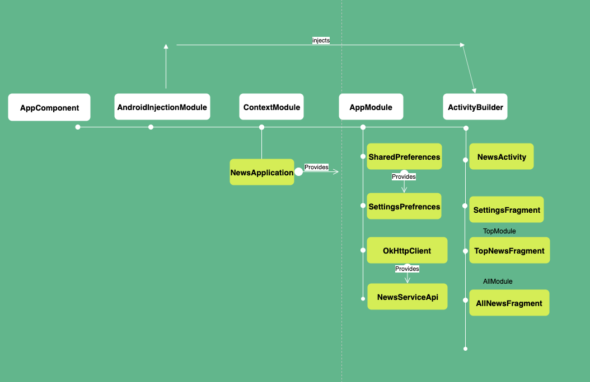

# Newsly  📑

[](https://ktlint.github.io/)

Newsly is an Android app for viewing the latest and the most trend in your country.

It displays the latest  news, top trend, with country prefrences. never miss any article with Newsly

<br>

| Top news | Latest News | country based news | detailed news |
| ------ | ----- | ------ | ----- |
|  |  |  |  |

| article source | 
| ------ | 
| |
 


## Android development

Newsly attempts to make use of the latest Android libraries and best practices:
* Entirely written in [Kotlin](https://kotlinlang.org/) (including [Rxjava](https://github.com/ReactiveX/RxJava)) with [ktlint](https://github.com/pinterest/ktlint) for code style
* Makes use of [Android Jetpack](https://developer.android.com/jetpack/), including:
  * All appropriate [Architecture Components](https://developer.android.com/jetpack/arch/), including **Lifecycles**, **Navigation** 
  * Mvp Architecture
  * [ConstraintLayout](https://developer.android.com/reference/androidx/constraintlayout/widget/ConstraintLayout) 2.0.
  * [Android KTX](https://developer.android.com/kotlin/ktx) for more fluent use of Android APIs
* [Retrofit](https://square.github.io/retrofit/)/[OkHttp](https://square.github.io/okhttp/) for networking
* [Glide](https://github.com/bumptech/glide) for image loading
* [Dagger](https://google.github.io/dagger/) for dependency injection
* Designed and built using Material Design [tools](https://material.io/tools/) and [components](https://material.io/develop/android/)
* Fully Testable using [mockito](https://github.com/nhaarman/mockito-kotlin) 

## MVP Architecture 

The following diagram shows the Architecture  of the app.


## Dependency Graph 

The following diagram shows the dependency graph of the app.




## License

```
Copyright 2019 Omar Tamimi

Licensed to the Apache Software Foundation (ASF) under one or more contributor
license agreements. See the NOTICE file distributed with this work for
additional information regarding copyright ownership. The ASF licenses this
file to you under the Apache License, Version 2.0 (the "License"); you may not
use this file except in compliance with the License. You may obtain a copy of
the License at

   http://www.apache.org/licenses/LICENSE-2.0

Unless required by applicable law or agreed to in writing, software
distributed under the License is distributed on an "AS IS" BASIS, WITHOUT
WARRANTIES OR CONDITIONS OF ANY KIND, either express or implied. See the
License for the specific language governing permissions and limitations under
the License.
```
